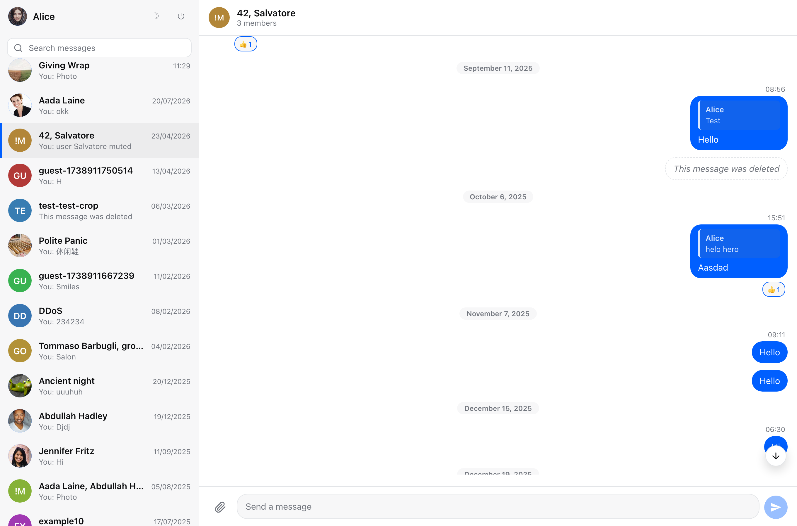
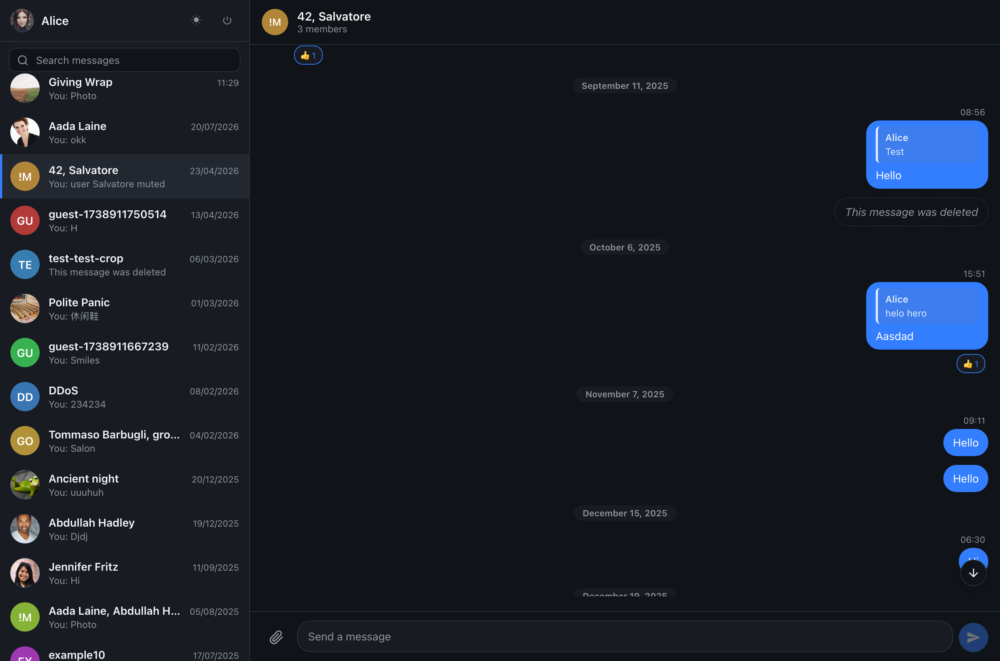
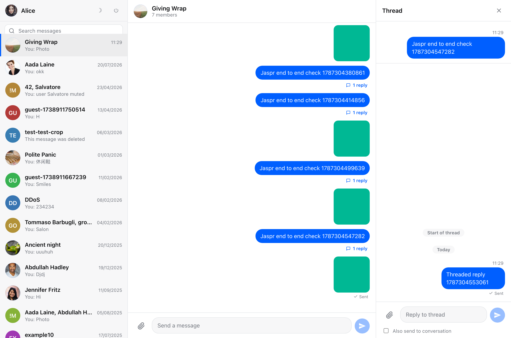
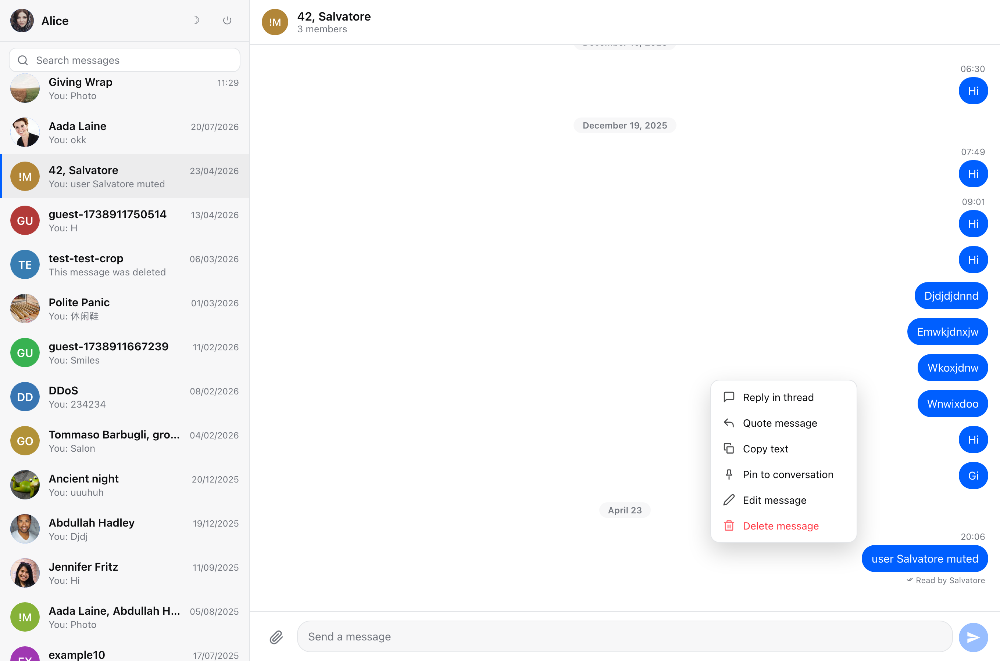

# Stream Chat for Jaspr

Chat UI components for [Jaspr](https://jaspr.site), built on the official
[Stream Chat Dart client](https://pub.dev/packages/stream_chat).

This project brings the component model of the
[Stream Chat Flutter SDK](https://github.com/GetStream/stream-chat-flutter) to the web as
plain DOM. There is no canvas renderer, no Flutter engine, and no WebAssembly payload. The
release build of the example application is 0.8 MB of JavaScript, 233 KB gzipped.

> **Status: experimental.** This is a feasibility study, not a supported product. Breaking
> changes should be expected, and some features of the Flutter SDK are still missing. See
> [Feature coverage](#feature-coverage) before adopting it.







## Overview

The Stream Chat Dart client is a pure Dart package. It has no dependency on Flutter and
already ships conditional imports for the browser, including a web platform detector and a
web socket transport. It compiles and runs unmodified under `dart compile js`.

As a result, porting the SDK to Jaspr is a presentation layer exercise. Networking, event
handling, offline reconciliation, and channel state are all reused from the existing client.

| Flutter SDK package | Status in this project |
| --- | --- |
| `stream_chat` | Reused without modification |
| `stream_chat_flutter_core` | Reimplemented, reduced scope |
| `stream_chat_flutter` | Reimplemented as DOM components |
| `stream_chat_persistence` | Not ported. Drift and SQLite are not browser targets |
| `stream_chat_localizations` | Not ported. `StreamChatTranslations` provides the hook |

`stream_chat_jaspr` re-exports `stream_chat`, so `Channel`, `Message`, `Filter`,
`client.on(...)`, and the rest of the low level API are available from a single import and
behave exactly as they do in the Flutter SDK.

## Repository layout

| Path | Contents |
| --- | --- |
| `packages/stream_chat_jaspr` | The component library |
| `example` | A chat application built with the library |
| `docs` | Screenshots used by this document |

## Requirements

| Dependency | Version |
| --- | --- |
| Dart SDK | 3.11 or later (developed against 3.13.1) |
| `jaspr` | 0.23.4 |
| `stream_chat` | 10.3.0 |

## Installation

```yaml
dependencies:
  stream_chat_jaspr:
    path: packages/stream_chat_jaspr
```

The package is not published to pub.dev.

## Quick start

```dart
import 'package:jaspr/dom.dart' hide Filter; // stream_chat also exports a Filter
import 'package:jaspr/jaspr.dart';
import 'package:stream_chat_jaspr/stream_chat_jaspr.dart';

final client = StreamChatClient('your-api-key');
await client.connectUser(User(id: 'jane'), tokenFromYourBackend);

StreamChat(
  client: client,
  theme: StreamChatTheme.dark(),
  child: StreamChannel(
    channel: client.channel('messaging', id: 'general'),
    child: Component.fragment([
      StreamChannelHeader(),
      StreamMessageListView(),
      StreamTypingIndicator(),
      StreamMessageInput(),
    ]),
  ),
);
```

`StreamChat` injects the stylesheet and the active theme's CSS custom properties. Pass
`injectStyles: false` to render `Style(styles: streamChatStyles)` yourself, for example once
at the document level rather than once per chat surface.

Threads are opened from the message action menu and stored on the channel scope, so a
thread pane is a sibling of the conversation rather than a route:

```dart
StreamChannel(
  channel: channel,
  child: Builder(builder: (context) {
    final state = StreamChannel.of(context);
    final thread = state.openThread;

    return div([
      div([
        StreamChannelHeader(),
        StreamMessageListView(),
        StreamTypingIndicator(),
        StreamMessageInput(),
      ], classes: 'sc-conversation'),
      if (thread != null)
        StreamThreadView(
          key: ValueKey(thread.id),
          parent: thread,
          onClose: state.closeThread,
        ),
    ], classes: 'sc-conversation-split', attributes: {
      'data-thread': thread == null ? 'closed' : 'open',
    });
  }),
);
```

User tokens must be generated on a server using your API secret. Never ship the secret to
the browser.

## Components

### Scopes

| Component | Responsibility |
| --- | --- |
| `StreamChat` | Provides the client and theme to the subtree, injects the stylesheet |
| `StreamChannel` | Watches a channel and provides it to descendants |

### State

| Type | Responsibility |
| --- | --- |
| `StreamChannelListController` | A `ChangeNotifier` that pages through `queryChannels` and applies live events |
| `StreamMessageComposerController` | Draft text, attachments, quoted message, and edit target for one composer |
| `StreamMessageSearchController` | Debounced, paginated `search` queries for one channel |

### UI

| Component | Description |
| --- | --- |
| `StreamChannelListView` | Scrollable, paginated channel list |
| `StreamChannelListTile` | Channel row with avatar, last message preview, unread badge |
| `StreamChannelHeader` | Title bar with avatar, member count, and presence |
| `StreamMessageListView` | Message history with author grouping, date separators, and read receipts |
| `StreamMessageTile` | Single message with bubble, quote, attachments, reactions, and thread footer |
| `StreamMessageActions` | Hover and keyboard action bar with the reaction picker and overflow menu |
| `StreamReactionPicker` | Emoji row that toggles the current user's reactions |
| `StreamMessageInput` | Composer with attachments, mentions, commands, quoting, and editing |
| `StreamAttachmentList` | Image grid, video, audio, files, giphy, and link previews |
| `StreamImageGallery` | Full screen viewer with paging and download |
| `StreamThreadView` | A thread's parent, replies, and dedicated composer |
| `StreamMessageSearchView` | Search field with paginated results |
| `StreamPopover` | Anchored overlay with scrim and escape-to-dismiss |
| `StreamAvatar` | Circular avatar with a deterministic initials fallback |
| `StreamTypingIndicator` | Live "user is typing" line |
| `StreamConnectionStatusBanner` | Banner shown while reconnecting or offline |



## Theming

`StreamChatTheme` is compiled to CSS custom properties and applied once to the root element.
Every rule in the stylesheet resolves through those variables, so changing a theme updates a
single style attribute instead of rebuilding the component tree.

```dart
StreamChat(
  client: client,
  theme: StreamChatTheme.dark().copyWith(
    primary: const Color('#7c3aed'),
    borderRadius: '8px',
  ),
  child: myChatSurface,
);
```

`StreamChatTheme.light()` and `StreamChatTheme.dark()` are provided. For changes that the
tokens do not cover, target the `sc-` prefixed classes directly. They are defined in
`packages/stream_chat_jaspr/lib/src/theme/stream_chat_styles.dart`.

## Translations

Every user facing string lives on `StreamChatTranslations`. Subclass it, override what you
need, and pass it to the scope.

```dart
class GermanTranslations extends StreamChatTranslations {
  const GermanTranslations();

  @override
  String get sendAMessage => 'Nachricht senden';

  @override
  String get replyInThread => 'Im Thread antworten';
}

StreamChat(
  client: client,
  translations: const GermanTranslations(),
  child: myChatSurface,
);
```

Anything left unoverridden falls back to English. Date and relative time formatting reads
its labels from the same object, so `today`, `yesterday`, and the weekday names travel with
the rest of the strings.

## Running the example

```bash
cd example
dart pub get
dart run tool/dev.dart
```

The application is served at <http://localhost:8080>. The sign in screen offers two public
sandbox accounts, the same credentials used by the Stream Flutter tutorials.

See [`example/README.md`](example/README.md) for additional options.

## Feature coverage

### Supported

- Channel list with pagination, live previews, and unread counts
- Message history with pagination, author grouping, and date separators
- Sending, editing, deleting, and resending messages
- Quoted replies, with a jump target back to the quoted message
- Threads: reply count footers, a thread pane, and a thread composer with
  "also send to conversation"
- Reactions: a picker, own reaction state, and counts
- Message actions: reply in thread, quote, copy, pin, flag, edit, delete, resend
- Attachment uploads by file picker, drag and drop, or paste, with local previews
  and per-file progress
- Attachment rendering: image grids, video, audio, files, giphy, and link previews
- A full screen image gallery with paging and download
- Mention autocomplete over channel members and slash command autocomplete
- Message search with debouncing and pagination
- Typing indicators
- Read receipts, delivery state, and unread counts
- Connection status reporting
- Deleted, failed, and pending message states
- Translations through `StreamChatTranslations`
- Keyboard operable action menus, ARIA roles on live regions and dialogs
- Light and dark themes
- Responsive layout: three panes, collapsing to two below 1100 px and one below 760 px

### Not supported

- Offline persistence
- Polls, drafts, reminders, location sharing, and AI streaming responses
- Channel and user administration: member lists, user lists, invites, muting, archiving
- Voice recording, image editing, and camera capture
- Bundled locales. `StreamChatTranslations` is the extension point, but only English
  ships with the package
- Emoji picker beyond the six default reactions

## Implementation notes

These decisions differ from the Flutter SDK and are relevant when reading or extending the
code.

### Scroll anchoring is handled by CSS

`.sc-message-list` uses `flex-direction: column-reverse`. Browsers anchor scrolling to the
visual bottom of a reversed flex container, so appending a message keeps the viewport pinned
while a user who has scrolled up stays in place. No scroll controller or imperative scroll
call is required. The trade off is that children are emitted newest first, so
`StreamMessageListView` builds the list in chronological order and reverses it before
rendering.

### The composer is uncontrolled between renders

Jaspr rebuilds `input` and `textarea` from their `value` attribute, which resets the caret
whenever the draft changes. The composer therefore does not re-render on every keystroke.
It writes to `StreamMessageComposerController` and only bumps a `ValueKey` revision when
the field's contents must be replaced wholesale, such as after sending, when accepting an
autocomplete suggestion, or when loading a message for editing. Autogrow is applied by
setting `style.height` directly from `scrollHeight` in the input handler, for the same
reason.

### Sends are optimistic, with a snapshot to roll back to

`StreamMessageComposerController.snapshot()` captures the draft, attachments, and quote
before a send, and the composer clears immediately rather than waiting for the request.
`restore()` puts it all back if the request is rejected. Clearing first matters because the
client renders the message optimistically, so anything left behind reads as a duplicate for
however long an attachment upload takes, and it leaves the field free to type the next
message.

### Overlays render inline rather than in a portal

`StreamPopover` renders where it is declared. It draws a transparent full screen scrim
behind its content, which gives it click-outside dismissal and its own stacking context
without needing a root level overlay host to portal into. Escape is handled by a document
level listener registered for as long as the popover is mounted.

### Action bars fade rather than hide

The per-message action bar uses `opacity: 0` until the message is hovered or contains
focus. `visibility: hidden` and `display: none` would both remove the buttons from the tab
order, which would make the actions unreachable by keyboard and prevent `:focus-within`
from ever matching.

### Theming uses CSS custom properties

The Flutter SDK resolves theme values from the widget tree on every build. This package
emits `StreamChatTheme.cssVariables` onto the root element once and resolves colours through
`var(--sc-*)` in the stylesheet.

### No code generation

The package uses no `jaspr_builder` annotations. There are no `@client`, `@css`, or
`@Import` directives. The stylesheet is a `List<StyleRule>` rendered through Jaspr's `Style`
component, so consumers require no build step. This also keeps the project buildable on the
current SDK, as described in [Toolchain constraints](#toolchain-constraints).

### Type checks against JS interop types

`package:web` types are extension types and are erased at runtime. An expression such as
`event.target is Element` evaluates to `true` unconditionally and checks nothing. The
analyzer reports this as `invalid_runtime_check_with_js_interop_types`.

Event handlers in this package narrow with `as` instead, which is correct because the target
of a scroll event is always the element the handler is bound to. The stricter alternative,
`isA<T>()`, requires `dart:js_interop`, which is unavailable on the Dart VM and would
prevent the package from compiling for server side rendering.

### No application lifecycle handling

`StreamChatCore` in the Flutter SDK disconnects the socket after a keep alive window when
the application is backgrounded, because mobile operating systems suspend applications and
close sockets. Browsers keep web sockets open in background tabs, and the Dart client
already reconnects with backoff, so this package has no equivalent behaviour.

## Toolchain constraints

`jaspr serve` cannot be used on Dart 3.11 or later. `jaspr_web_compilers` declares a
constraint of `>=3.7.0 <3.11.0-z`, while `stream_chat` 10.1 and later require `^3.11.0`.
The two ranges do not intersect, so the standard `build_runner` pipeline cannot resolve
alongside a current Stream Chat client.

Because the project uses no code generation, this has no effect on the output.
`example/tool/dev.dart` compiles with `dart compile js` and serves the result with `shelf`:

```bash
dart run tool/dev.dart                # build, serve, and rebuild on change
dart run tool/dev.dart --release      # optimised build
dart run tool/dev.dart --port 3000    # serve on a different port
```

Two paths remove the constraint. Pinning `stream_chat` to 10.0.0, the last release that
accepts Dart below 3.11, restores `jaspr serve` at the cost of staying one version behind.
Alternatively, once `jaspr_web_compilers` supports the current SDK, `tool/dev.dart` can be
deleted in favour of `jaspr serve`.

## Development

```bash
# Component library
cd packages/stream_chat_jaspr
dart pub get
dart analyze
dart test

# Example application
cd example
dart pub get
dart analyze
dart run tool/dev.dart --no-serve
```

The library ships 84 tests covering the formatting utilities, message text tokenisation,
autocomplete detection, the composer and search controllers, channel and message preview
logic, and the components that render without a connected client. The snippets in this
document live in `test/readme_snippets_test.dart` so that the analyzer keeps them honest.

Browser behaviour was verified against Stream's public demo application by driving headless
Chrome over the DevTools Protocol. The run signs in, loads 20 channels, opens a channel,
pages history, opens the reaction picker and toggles a reaction, opens the overflow menu,
quotes and unquotes a message, sends a message with synthesised key events, checks the
delivery indicator, triggers and accepts mention autocomplete, opens a thread and replies
in it, searches for the message it just sent, edits and cancels an edit, uploads an image
by dispatching a synthetic `DataTransfer`, opens and closes the gallery, and confirms
keyboard access to the action bar. The run completes with no console errors and no uncaught
exceptions.
